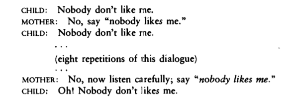

In part 1, I showed how one might come to the conclusion that children never even try to make certain generalizations about the language data they receive. Note that the conclusion does not go beyond what is implied by the premises that we looked at in the previous post. I try to avoid saying anything confusing like _rules of grammar are innate_ or _grammar is in our genes_ as much as possible, simply because it does not follow from the logic of the POS argument alone. Whether (and how much of) our knowledge of language is _innate_ is an empirical problem and must be solved by interdisciplinary research, which includes linguistics, evolutionary biology and neurology.

Instead, let us look at how good the premises of the POS argument are.

### Is evidence really that thin?

(1) Will the man who is tall leave now?  
(2) How could anyone that was awake not hear that?

If you are a careful reader, you must have thought that it is not obvious that children do not hear _enough_ of some complex utterances like (1) or (2). This is an empirical question and the only way to confirm this is to literally observe the conversations between children and their parents. Fortunately, this is exactly what some scientists did. The [CHILDES](https://childes.talkbank.org/) corpus is a huge database of child- and child-directed speech in text format. With such a powerful tool at hand, we can look at actual numbers: absolute and relative frequencies of words and sentences in PLD.

For example, one rule that English-speaking children must certainly figure out is that all sentences in English require a subject. This is something that must be learned because in other languages like Spanish, Italian or Japanese, subjects are optional. However, by observing rather frequent sentences like _I like pizza_, a child can only conclude that you _can_ use subjects in sentences, not that you _must_. The core evidence comes from sentences like _There is a man in the room_. In such sentences _there_ seems to be used only because something _must_ be in the subject position (e.g. you can't say _Is a man in the room_ in English, although it is perfectly enough to express the same thought).

[Yang (2002)](https://dspace.mit.edu/bitstream/handle/1721.1/86586/48125267-MIT.pdf;sequence=2) found that such sentences amount to about 1.2% of PLD. This means that to figure out some other rule like the correct way to ask a Yes/No question, a child probably needs to observe the crucial relevant evidence 1.2% of the time. However, Legate & Yang (2002) [found](https://www.ling.upenn.edu/~ycharles/papers/tlr-final.pdf) that relevant Yes/No questions like (1) amount to only 0.045-0.068% of PLD! Moreover, amoung roughly 67000 sentences, not a single sentence of the same form as (2) was found. It is also known that, on average, a child's use of subjects becomes adult-like at around 3.0 years old, which is roughly the same as the age when children start to correctly use complex Yes/No questions (3.2 years old).

So, yes, the evidence that is available to a child is indeed very thin.

### Aren't mistakes corrected?

In part 1, I mentioned that since children are not exposed to _negative_ data, they cannot conclude that among several correct-looking rules only one is in fact correct. Obviously, since adults are already proficient they never make mistakes (and correct themselves immediately) -- something that would count as negative data. But wouldn't it count as negative data if children themselves made mistakes and adults corrected them?

It would, but as it turns out, children too almost never make mistakes in Yes/No questions that need to be corrected. Moreover, there is plenty of evidence that even when children do make mistakes, they ignore efforts of their parents to correct their grammar. Here's one dialog observed by a linguist David McNeill:

The cross-cultural study of linguistic interaction between children and adults further proves that negative evidence is not even required. In [one South American village](https://www.scientificamerican.com/article/parents-in-a-remote-amazon-village-barely-talk-to-their-babies-mdash-and-the-kids-are-fine/), for example, parents barely talk to their children -- but the children seem to be fine.

### Is absence of evidence evidence of absence?

Philosophically speaking, no. Just because you have never seen a lion does not mean that lions don't exist -- you just need to look better. But there is no reason why children would have to be logically pedantic -- we are talking about a specific biological and psychological mechanism. It is, in theory, possible that if children never observe a sentence that is formed by a certain rule, they conclude that such a rule does not exist. In a sense, then, the absence of ill-formed sentences may count as so-called _indirect negative evidence_.

This is a fairly tricky problem. Without a certain learning model in mind, you cannot _prove_ that indirect negative evidence really plays a role in language acquisition. As Yang (2016) argues [in his latest book](https://mitpress.mit.edu/books/price-linguistic-productivity), many proposed models are psychologically unrealistic. One such model, for example, assumes the existence of the Subset Principle, which states that learners are conservative and must choose the smaller hypothesis that is compatible with the data first. In relation to our discussion in part 1, this would mean choosing rule (b) or (c) first instead of (a). But deciding which hypothesis' extension is a subset of another may require potentially _infinite_ computation which is certainly impossible for our brains. The newer learning models that make use of Bayesian inference (where absence of evidence naturally leads to a stronger hypothesis) also do not seem to do well in this respect.

I am not very familiar with the details of this kind of research. But, on the whole, it seems that there are no plausible models yet that convincingly show how children might make use of indirect negative evidence during language acquisition.

Hopefully, by now it should be clear what the POS argument says and why it is not at all easy to explain how children acquire language -- all overly simple guesses are rejected by empirical evidence. But knowing how exactly our guesses fail
certainly helps us to build better theories.

### Recommended reading

I am in the middle of reading the new book by Chris Yang, _The Price of Linguistic Productivity_. It is a very good overview of many previous theories of language acquistion and contains pretty good arguments in favor of the existence of rules of grammar. The author also proposes his own learning model that is based on the so-called Tolerance Princinple. This is basically a single equation, that explains the dynamics of hypothesis generation and how it is influenced by encountered exceptions. I think I may write a post about some of the points made in the book someday.
