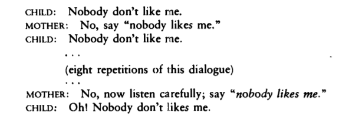

В части 1 я показал как можно прийти к выводу, что дети никогда не делают определенные обобщения доступных им языковых данных. Заметьте, что вывод не заходит дальше чем подразумевается предпосылками аргумента, которые мы рассмотрели в предыдущем посте. Я стараюсь по-максимуму избегать сбивающих с толку выражений вроде _грамматические правила врожденные_ или _грамматика присутствует в наших генах_, просто потому, что это не следует из одной лишь логики аргумента о бедности стимула. Является ли, и насколько наше знание языка является _врожденным_ -- это проблема эмпирическая и требует решения в междисциплинарном исследовании, которое включает в себя лингвистику, эволюционную биологию и нейрологию.

Взамен, давайте посмотрим насколько хороши предпосылки аргумента о бедности стимула.

### Настолько ли свидетельство слабое?

(1) Will the man who is tall leave now?  
(2) How could anyone that was awake not hear that?

Если вы внимательный читатель, то наверно подумали, что совсем неочевидно то, что дети недостаточно слышат сложных выражений вроде (1) или (2). Это тоже эмпирический вопрос, и единственный способ на него ответить это буквально наблюдать беседы родителей и их детей. К счастью, именно так некоторые учёные и поступили. Корпус [CHILDES](https://childes.talkbank.org/) -- это гигантская база данных детской речи и речи направленной на детей. С помощью такого мощного инструмента мы можем посмотреть на реальные цифры: абсолютную и относительную частоту слов и предложений в ПЛД.

Например, одно из правил, которое должны узнать дети англоговорящих людей, заключается в том, что все предложения в английского требуют, чтобы в них был субъект (подлежащее). Это нечто, что должно быть именно выучено, так как есть языки, в которых субъект необязателен, например испанский, итальянский или японский. Однако, наблюдая достаточно частые предложения вроде _I like pizza_, ребенок может только прийти к выводу, что субъекты _можно_ использовать в предложениях, но не к выводу, что субъекты _нужно_ использовать. Ключевым свидетелельством являются предложения вроде _There is a man in the room_. В этих предложениях, _there_ используется только потому что что-то _должно_ находится в позиции субъекта (например, нельзя сказать _Is a man in the room_ в английском, несмотря на то, что этого более чем достаточно для передачи одной и той же мысли).

[Янг (2002)](https://dspace.mit.edu/bitstream/handle/1721.1/86586/48125267-MIT.pdf;sequence=2) обнаружил, что подобные предложения составляют 1.2% от всех ПЛД. Это означает, что для обнаружения какого-либо другого правила вроде правильного способа задать Да/Нет вопрос, ребенку нужно чтобы ключевое свидетельство встречалось 1.2% времени. Однако, Легейт & Янг (2002) [выяснили](https://www.ling.upenn.edu/~ycharles/papers/tlr-final.pdf), что необходимые Да/Нет вопросы вроде (1) составляют лишь 0.045-0.068% от ПЛД. Более того, среди около 67000 предложений, ни одного предложения такой же формы как (2) не было найдено. Также известно, что, в среднем, использование субъектов детьми становится похожим на взрослое примерно к 3;0 годам, что примерно равно возрасту, когда дети начинают правильно формировать сложные Да/Нет вопросы (3;2 года),

Так что, да, свидетельство доступное детям действительно весьма слабое.

### Не исправляются ли ошибки?

В части 1 я упомянул, что так как детям недоступны _отрицательные_ данные, они не могут заключить, что среди нескольких правил, которые выглядят правильно, только одно действительно правильно. Очевидно, что поскольку взрослые уже владеют языком, они не допускают ошибок (и не исправляют себя моментально) -- именно это можно было бы считать отрицательными данными. Но нельзя ли считать отрицательными данными случаи, когда дети сами ошибаются, а родители их исправляют?

Можно, но насколько известно, дети сами почти никогда не допускают ошибок в Да/Нет вопросах, которые нужно было бы исправлять. Более того, есть весомое свидетельство, что даже когда дети допускают ошибки, они игнорируют любые попытки родителей исправить их грамматику. Вот один диалог, который наблюдал лингвист Дэвид МакНил:

Межкультурные исследования языкового взаимодействия детей и взрослых еще больше указывают на то, что отрицательные данные и вовсе не так необходимы для успешного усвоения языка. [В одной южноамериканской деревне](https://www.scientificamerican.com/article/parents-in-a-remote-amazon-village-barely-talk-to-their-babies-mdash-and-the-kids-are-fine/), например, взрослые вообще почти не разговаривают со своими детьми -- и тем не менее у детей все хорошо.

### Является ли отсутствие свидетельства свидетельством отсутствия?

С точки зрения философии, нет. Даже если ты никогда не видел льва, это не означает что львов не существует -- просто нужно искать получше. Но нет никакой причины полагать, что детям необходимо быть логически педантичными -- речь идет о специфическом биологическом и психологическом механизме. В теории, возможно, что если дети никогда не встречают предложения, сформированного определенным правилом, они могут считать что такого правила не существует. Тогда, в некотором смысле, отсутствие некорректных предложений можно считать так называемыми _косвенными отрицательными данными_.

Это достаточно скользкая проблема. Вне определенной модели обучения невозможно _доказать_ что косвенные отрицательные данные играют роль в усвоении языка. [В своей новейшей книге](https://mitpress.mit.edu/books/price-linguistic-productivity), Янг (2016) утверждает, что большинство предложенных моделей психологически нереалистичны. Одна из таких моделей, например, построена на Принципе Подмножества, которое твердит, что учащийся консервативен и всегда выбирает наименьшую гипотезу, согласную с наблюдениями. В контексте моего первого поста, это означает изначальный выбор правила (б) или (в) вместо (а). Но принятие решения о том, какая гипотеза является подмножеством другой -- это задача, которая потенциально требует _бесконечного_ вычисления, на что наш мозг конечно же не способен. Более новые модели обучения используют Байесовский вывод (в котором отсутствие свидетельства натурально ведет к укреплению гипотезы). Однако и эти модели, судя по всему, не очень успешны в отношении психологической реалистичности.

Я не очень знаком с деталями подобных исследований. Но кажется что, в целом, пока не существует правдопобных моделей которые убедительно показывали бы как косвенные отрицательные данные играют роль в усвоении языка ребенком.

Надеюсь, что теперь должно быть ясно что из себя представляет аргумент о бедности стимула и почему далеко не легко объяснить как дети усваивают язык -- все примитивные объяснения опровержены экпериментальным свидетельством. Но знание того, чем именно плохи примитивные объяснения, однозначно помогает нам конструировать лучшие теории.

### Что почитать

Я в процессе чтения новой книги Криса Янга _The Price of Linguistic Productivity_. Книга представляет собой отличный обзор многих предшествующих теорий усвоения языка и содержит весьма хорошие аргументы в пользу (натурального) существования правил грамматики. Автор также предлагает свою собственную модель, которая построена на так называемом Принципе Толерантности. По сути это одно уравнение, которое объясняет динамику генерации гипотез и как она зависит от встречаемых в данных исключений. Я думаю, что может быть когда-нибудь напишу пост о некоторых мыслях, высказанных в книге.
